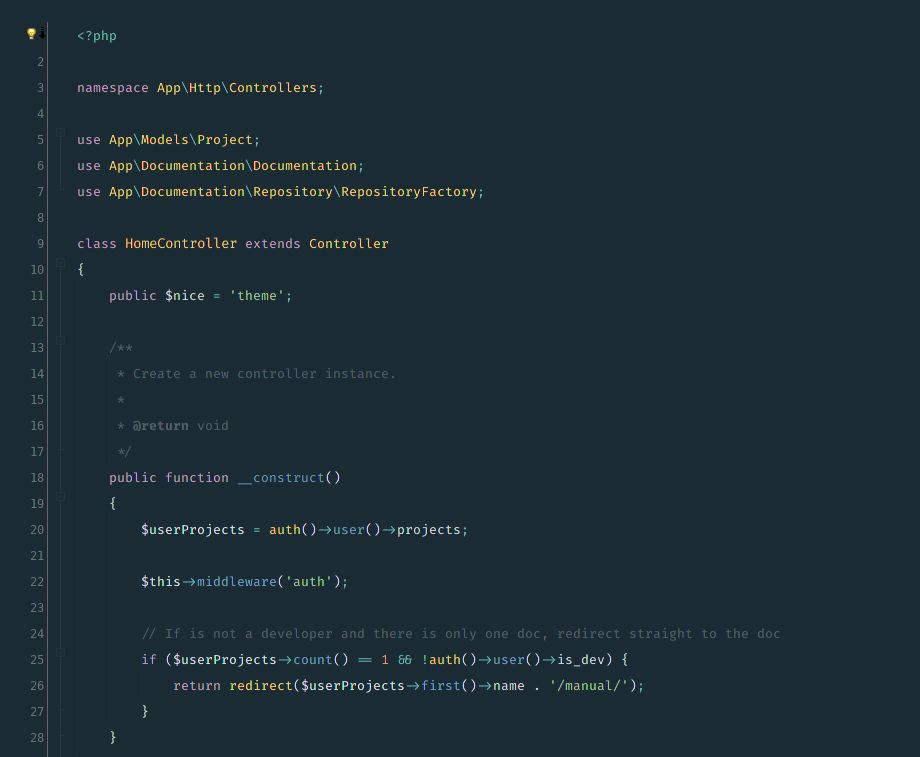

# OceanicBeans

Um esquema de cor feito para [Netbeans IDE](https://netbeans.org) com base no belíssimo [voronianski's Oceanic Next](https://github.com/voronianski/oceanic-next-color-scheme).

São adicionados ajustes e melhorias como a altura das linhas e pequenos detalhes que fazem a diferença.

## Instalar

1.  Faça o download do arquivo zip na tela de [Releases do GitHUB](https://github.com/ricardopedias/oceanic-beans/releases).
2.  Não extraia o zip!
3.  No Netbeans, acesse `Options` `->` `Fonts & Colors` `->` `Import` e escolha o arquivo zip

